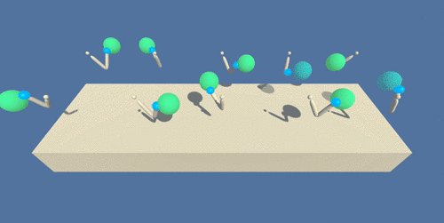

# Continuous Control using Deep Reinforcement Learning (Policy-Based Methods)

## Introduction

The goal in this project is to controlling a double-jointed arm, to reach target locations in a 3-D Box-like environment. By applying deep reinforcement learning to this environment, the "robotic arm" agentessentially learns to follow a goal location to follow. This method solves the continous control aspect of any A.I agent due to the ability handle continuous action spaces. Read my blog on [Medium](https://ahtchow.medium.com/solving-navigation-using-deep-reinforcement-learning-value-based-methods-3fe74fe85876) for this project!




---
## Real-World Robotics

The application of this project is targeted for, while not limited to, robotic arms. Once the control aspect of the stack is solved, one can then generate a behaviour to plan tasks.


Futhermore, it is possible to increase productivity of manufacturing by sharing the trained policy. It has been shown that having multiple copies of the same agent [sharing experience can accelerate learning](https://ai.googleblog.com/2016/10/how-robots-can-acquire-new-skills-from.html), as I learned from solving the project!


---
## Understanding the environment

**Summary**

In this environment, a double-jointed arm can move to target locations. A reward of +0.1 is provided for each step that the agent's hand is in the goal location. Thus, the goal of your agent is to maintain its position at the target location for as many time steps as possible.

**RL Problem Specifications**


    
-    **Goal of Agent** : move to target locations 
-    **Rewards** : ```+0.1``` every step in the goal location, ```+0.0```  every step out of the goal location
-    **Action Space** - Continuous, 4-Dimension Vector Space from [-1, +1]
-    **State Space** - Continuous, 33-Dimension
-    **Solving Condition** : Average score of +300.00 over 100 consecutive episodes. 

**More on State and action spaces**

The observation space consists of 33 variables corresponding to position, rotation, velocity, and angular velocities of the arm. Each action is a vector with four numbers, corresponding to torque applicable to two joints. Every entry in the action vector should be a number between -1 and 1. This is a continous action space, thus we will use some actor-critic method to tackle this environment.

**Solving the Environment**

Option 1: Solve the First Version

The task is episodic, and in order to solve the environment, your agent must get an average score of +30 over 100 consecutive episodes.

Option 2: Solve the Second Version

The barrier for solving the second version of the environment is slightly different, to take into account the presence of many agents. In particular, your agents must get an average score of +30 (over 100 consecutive episodes, and over all agents). Specifically,

- After each episode, we add up the rewards that each agent received (without discounting), to get a score for each agent. This yields 20 (potentially different) scores. We then take the average of these 20 scores.
- This yields an average score for each episode (where the average is over all 20 agents).

### Concepts and Resources used for this Project

Academic Resouce Papers:

* [Continuous control with deep reinforcement learning](https://arxiv.org/abs/1509.02971)
* [High-Dimensional Continuous Control Using Generalized Advantage Estimation](https://arxiv.org/pdf/1506.02438.pdf)
* [Q-Prop-Sample-Efficient Policy Gradient with An Off-Policy Critic](https://arxiv.org/pdf/1611.02247.pdf)


## Files Included in this repository

* The code used to create and train the Agent
  * DRL_Continuous_Control.ipynb : Driver code to run agent in environment!
  * DDPG_Agent.py : Deep Deterministic Policy Gradient reinforcement agent
  * networks.py : contains Actor and Critic neural networks
  * replay_buffer.py : Replay Buffer Data Structure
  * utils.py : helper functions for training
  * ornstien_uhlenbeck_noise.py : Dynamic noise handler for action exploration
* A file describing all the packages required to set up the environment
  * requirements.txt
* The trained model
  * checkpoint_critic.pth : Weights for Critic
  * checkpoint_actor.pth : Weights for Actor

* This README.md file

## Setting up the environment

This section describes how to get the code for this project and configure the environment.

### Getting the code
You have two options to get the code contained in this repository:
##### Option 1. Download it as a zip file

* [[click here]](https://github.com/ahtchow/Reinforcement-Learning-Continiuous-Control/archive/master.zip) to download all the content of this repository as a zip file
* Uncompress the downloaded file into a folder of your choice

##### Option 2. Clone this repository using Git version control system
If you are not sure about having Git installed in your system, run the following command to verify that:

```
$ git --version
```
If you need to install it, follow [this link](https://git-scm.com/downloads) to do so.

Having Git installed in your system, you can clone this repository by running the following command:

```
$ git clone https://github.com/ahtchow/Reinforcement-Learning-Continiuous-Control.git
```

### Configuring the environment
The `requirements.txt` file included in this repository describes all the packages and dependencies required to set up the environment. 

It is recommended that you [create a new conda environment](https://docs.conda.io/projects/conda/en/latest/user-guide/tasks/manage-environments.html), then use it to install ```pip install -r requirements.txt``` 

## How to train the Agent
The environment you have just set up has the files and tools to allow the training of the agent.  

Start the Jupyter Notebook server by running the commands below. A new browser tab will open with a list of the files in the current folder.

You must to set your operational system by downloading the appropriate executable coresponding to your OS. After you do this, drag and drop the correct files into the directory. (See Notebook for more instructions and clarificaiton)

The options available are:

Version 1: One (1) Agent:

Linux: [click here](https://s3-us-west-1.amazonaws.com/udacity-drlnd/P2/Reacher/one_agent/Reacher_Linux.zip)
Mac OSX: [click here](https://s3-us-west-1.amazonaws.com/udacity-drlnd/P2/Reacher/one_agent/Reacher.app.zip)
Windows (32-bit): [click here](https://s3-us-west-1.amazonaws.com/udacity-drlnd/P2/Reacher/one_agent/Reacher_Windows_x86.zip)
Windows (64-bit): [click here](https://s3-us-west-1.amazonaws.com/udacity-drlnd/P2/Reacher/one_agent/Reacher_Windows_x86_64.zip)

Version 2: Twenty (20) Agents:

Linux: [click here](https://s3-us-west-1.amazonaws.com/udacity-drlnd/P2/Reacher/Reacher_Linux.zip)
Mac OSX: [click here](https://s3-us-west-1.amazonaws.com/udacity-drlnd/P2/Reacher/Reacher.app.zip)
Windows (32-bit): [click here](https://s3-us-west-1.amazonaws.com/udacity-drlnd/P2/Reacher/Reacher_Windows_x86.zip)
Windows (64-bit): [click here](https://s3-us-west-1.amazonaws.com/udacity-drlnd/P2/Reacher/Reacher_Windows_x86_64.zip)


Use the jupyer notebook, Navigation.ipynb to run the models against the Unity Environment.


### Additional Notes

This environment has been built using the **Unity Machine Learning Agents Toolkit (ML-Agents)**, which is an open-source Unity plugin that enables games and simulations to serve as environments for training intelligent agents. You can read more about ML-Agents by perusing the [GitHub repository](https://github.com/Unity-Technologies/ml-agents).  

The project environment is provided by Unity, see Reacher on [Unity ML-Agents GitHub page](https://github.com/Unity-Technologies/ml-agents/blob/master/docs/Learning-Environment-Examples.md).  
